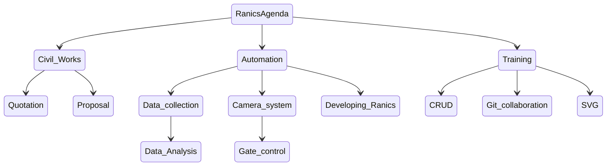

# Ranics

This is a system that will aid in carrying out daily carpack activities in mutall
carpark.

## The Systems Objectives

### Main objectives

1. Provide carpack services.

### Other objectives

1. Help us learn the basic data operations.
2. Aid us in collaborating in programming the system.
3. Be able to write a proposal.
4. Do advanced data management

## **Ranics in Relation to CRUD**

  > C - Create  
  > R - Review  
  > U - Update  
  > D - Delete  

CRUD shows the steps in which data operations occur. The language used is
Structured Query Language (SQL).

`CREATE`

 Data can be created through various ways such as:

- Forms.
- Images.
- Voice Recording.
- Data logger.

 `REVIEW`

This is the act of interrogating data for use.

 `UPDATE`

This includes adding of additional data to an existing data structure or
modifying data after reviewing.

`DELETE`

The act of removing data from a structure.

**SQL Statements and Their Functions**

> Create data - INSERT.  
> Review - SELECT.  
> Update - UPDATE.  
> Delete - DELETE.  

**Additional Statements**

> ALTER -Changes the data structure.  
> CREATE - Creates the data structure.

## Ranics Agenda

Ranics has 7 agenda items which are crucial to the CRUD module.

|   Civil Works   |  Automation    | Training     |
| ---- | ---- | ---- |
|  1. Quotations    |  3. Data collection    |  6. CRUD    |
| 2. Proposal     |  4. Camera system - Gate control | 7. Git Collaboration    |
|  |   5. Developing Ranics    | 8. SVG |

### Civil Works

##### Quotations

Compare three different quotations from different vendors. For price evaluation and review. Learn how to (JN)

##### Proposal  

Write a proposal of the system for funding request. (DK)

### Automation

#### Data collection  

Collect data for a month for effective review and learning how to manipulate data. (PK)

##### Data analysis
-[ ]1. Plot the rate line graph
 [X]1.1 In Excel [JM]
 [X]1.1.1 Do a url for retrieving data from the database in a CSV format
 [X]1.1.2 Read data from the web and sketch the scater plot[JM]
-[x]1.2 Using SVG[Margie]
 [X]1.2.1 Change viewbox to 7 and 14.
 [X]1.2.2 Use the svg axis to plot the graph(inverted).
 [X]1.2.3 Group the graph and reflect it about the x-axis.
 [X]1.2.4 Translate the graph in the y-axis 7steps.
 []1.2.5 Use a path instead of lines for the polyline
 [] 1.2.6 Use a path instead of the polyline to draw the axes.
 []1.2.6 Rotate the dates .
-[X]1.3 Using D3JS[Carol]
 []1.3.1 Turn the perfomance as a cron tab.[PK]
 []1.3.1.1 Send an email everyday at 6 Mr Muraya showing the work going on.[PK] 
 []1.3.2 Include cars that come or leave before (8).[pk]
 [] union of the three and calculate 
 [] bar chart of before and after the adjustment

-[ ] 2.Plot the duration histogram using D3[PK] 
-[ ] 3.Include error checks to highlite missing flows.[FN]
-[ ] 4.keeping Node.JS agenda alive.[JO]

-[]The activity graph should be on homepage.
##### Camera systems

Research and present on how to use a camera system for the carpark. And also find out how the automated carparks operate by visiting three different carparks, how they are installed and implemented, also the modes of payment.(SW)  
How the gate control system works.

Research on how to get data from the NTSA database system.(JN)

##### Developing Ranics

Develop Ranics actual software;

- Design a data model.(FN)  
- Implement the data model.

### Training

##### CRUD

- Collect data
- Learn how to review
- Data collected will help determine how long it will take for the spent money to be recovered.
  
##### Git Collaboration

Learn how to use git to work together on the Ranics project.

- Install Github Desktop.
- Demo on using git for collaboration(PM)
- Understanding the git terminologies.
  

###### `Quotations`
- [ ] 1. Follow up on the quotations from James(PK)
- [ ] 1.1 calculate the quotations for the three carpark sections.(pk) 
___
###### `Proposal`

- [ ] 1. Collect the required permits and documents. Follow up with where Kaniu had left off
        proceed further with the work.
        1.1 write a letter to the councel requesting for permission to start 
        the construction work(pk)
            1.1.1 Write and submit to both KENHA and the city councel.  
         
        1.2.2 images from onedrive Caro to annotate and print the startic image  MW to do the same using SVG.(CW.MW)  
            1.2.2.1 Complete annotating the carpark images. (cw)  
            1.2.2.2 Show adraft of the carpark area using svg in the next session. (MW)  
        - [ ] 1.2.3 carpark estimations from James broken into 3 sections
             :chicjoint,road reserve and front view section.(PK)

`07-03-2022`

###### **`Automation`**

    `Camera systems`

- [ ] 1. Visit the previous locations and find out how the automated car parks operate. (CW)
- Visit  _Galleria_, _The Hub_, _Water-front_, and _any other two_ to see how the cameras operate  physically.
- 1.1 Caro to bring back the images and brandnames to use.
- 1.2 Caro to get Camilas to draft an introduction letter for taking to the security attendants.
- [ ] 2. Search the internet for cameras to capture number plates.Follow up from where Sharon had left off.[]
- [ ] 2.1 Use aliexpress to get  specific camera.(MW)
- [ ] 2.2 research on the specific camera to get the design specifications including how the data is transmitted.(FN) 
  

`28-03-2022`
## Data Management
- [ ] 1. Update the applications page if the administration was successful/not aborted. (FN)
- [ ] 2. Update the database with data from the flow and stock tables.(FN)
- [ ] 2.1 Complete cleaning the data from the collection tables to allow migration into the new database. (FN)
    - Demonstrate the data interrogation guide by the  following questions. (Pk)
  - 
- [ ] Estimate the cars expected. (JK)
- [ ] 6. Estimate the cash for quotations and determine how long it will take to repay. (JK)
___
- How many cars can be potentially be clients.  
- How long a car stays.  
- Who are the owners.
- List all clients visit them and find out the cars they bring to the carpark.

`14-03-2022`
___
- Which cars frequently visit the carpark.
- Which car came once.
- Time spent by the car.
- Data collected by operator.
- How good is the recording of the flow. (look at the stock at one point in time - cars in and out and compare to the flow.)
  
- [ ] 7. Get a list of all the clients and give it to Margret. (JK)
___

### **`SVG`**

___

`21-03-2022`

- [x] 1. Convert the function line connect to TS, (PK)
    - Define a new line with a radius property. (PK)
    - Investigate how to create a new circle in svg.(PK,FN)
    - Draw a circle using javascript. (PK, FN)
    
- [x] 2.Add svg option to tracker to display the new template from James. (FN)
- [ ] 3.Document the function of transforming mouse coordinates to real world coordinates. (FN)
- [ ] 4. Implement the function to move the circle on click. (All) *"DEFERED"*
 