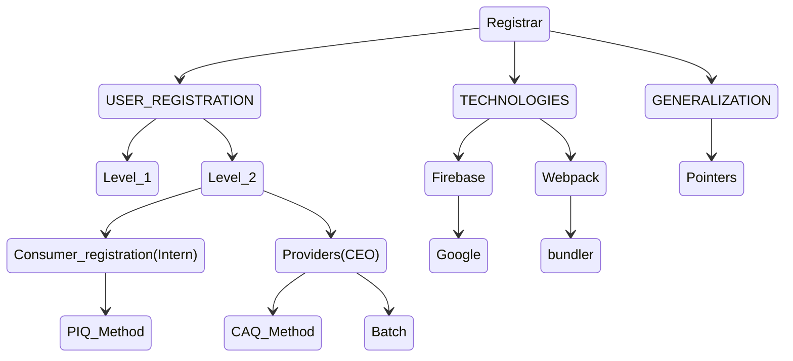

# Tracker

This is a system that will aid in tracking our daily activities and assignments.

## The Systems Objectives

1. To monitor assignments given to staff.
2. To keep records of all interns.
3. To monitor day to day operations.

(Tracker in relation to Registrar module)

In tracker application we intend to have three role players;The C.E.O of a
company,the staff and the developers of their systems.

## REGISTRAR AGENDA

# 1. USER REGISTRATION

## 1.1 C.E.O/SERVICE PROVIDER REGISTRATION 

### Proposal

1. Design a new model and add a relationship linking them to their applications
Add the C.E.O to the model.
 ## 1.1.1 BATCH

The C.E.O should be in a position to register.

- His organization.
- His developers.
- His staff.

## 1.2 INTERNS/SERVICE CONSUMER REGISTRATION

The interns in turn should be able to register.

- The organization they work for.
- The application they are currently working on.
- Their personal details.

`(Proposal)` 

1. Every developer(intern) should have an account in the tracker application in order
to.
- Receive payment
- Input tea expense receipts
2. Add a modules table.
3. Change from developer to intern

When registering a new intern, some of the questions to be asked are

- Their full name
- Mobile number
- Type of internship.
- Duration and the institution an intern is currently under
- Previous attachme+nts
- Qualification
- Residence
- Reference[who referred you to this program ?]  

### 1.2.1 Picture Image Questionnaire(PIQ)

This is a logical flow of questions intended to be answered by the user.

### 1.2.2 Computer Aided Questionnaire(CAQ)

In CIQ, the user is guided by the computer when entering the data 

**B** `(22-02-2022)`

1. Design a Computer  Assisted Questionnaire (CAQ) individual html pages for the chart.(SW)
2. Ensure the class step is working correctly.(DK)
3. Design the user interface.(FN)

# 2. TECHNOLOGIES.
## 2.1 GOOGLE
Use firebase for authentication rather than the basic form.

 # 3. GENERALIZATION
### 3.1 Pointers

 ## ASSIGNMENTS
 #### LEVEL 1
___

 - [x] 1. The complete level1 registration should be called when the 'ok' button is pressed in the login form. (FN) (FN)
 - [ ] 1.1 Develop and deploy the method for filling in a selector.Hint. use a selector query whose declaration is in the liblary.dt.s (PK.fn)
 - [ ] 1.2  use the method to Populate the organisation selector with data from the database.
 - [ ] 2. Add camillas to recognise both the application and the organisation roles at login.(FN)
 - [ ] 4. Run the login query in netbeans. (PK)
     - Add business to the join. (PK)
     - Use the JSON array aggregate function to produce an output with the below signature `["intern", "referee", "sponsor"], "mutall_data"`. (PK)
     - Modify the code so that the user includes the business property. (PK)
 - [ ] 5. Constrain the editor query with the organization that the person is logged in with.Hint. Study the editor/selector/view(query) modal to see how sql statements are constructed. Add the component that would constrain  the user to the current business. (PK, PM, FN)

 ### LEVEL 2
___
#### CONSUMER (INTERN)

___
##### PIQ

`2022-04-12`

- [] 1. Develop `register_intern.get_simple_inputs` method which returns simple layouts extracted from the questionnaire.Hint. Use the :not() pseudo class.
    - Complete the function for the remaining date,checkbox,radiobutton. Ensure text inputs from the tables are not selected. (PK)
  -[ ] 1.1 Review the method.
- [ ] 2. Develop `register_intern.get_table_inputs` method which returns the source of the data as a table layout and the destination as a list of labels with lookup expressions. (FN)
- [ ] 2.1 Complete the final method `get_body_value`.

##### CAQ

- [ ] 1. Retrieve and document step/execution code from DK. Under execution there is a class and a template involved. (FN)
    - class step
    - CAQ template 
- [ ] 2. Ensure that the current version of kentionary system works on your machine. (PK)

### Webpack
___

- [ ] 1 Research on how to use webpack bundler for node modules.
- [ ] 1 research on how to bundle firebase methods (from node modules) using webpack.

### Firebase /Google
___

- [ ] 1. Develop the google login(firebase in typscript) 
- [ ] 2. Use the previous code(outlook) and see if it's possible to reuse it(DK)
  

