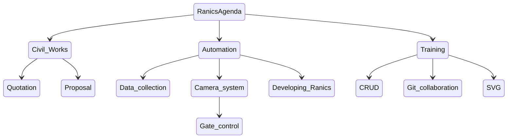

# Ranics

This is a system that will aid in carrying out daily carpack activities in mutall
carpark.

## The Systems Objectives

### Main objectives

1. Provide carpack services.

### Other objectives

1. Help us learn the basic data operations.
2. Aid us in collaborating in programming the system.
3. Be able to write a proposal.
4. Do advanced data management

## **Ranics in Relation to CRUD**

  > C - Create  
  > R - Review  
  > U - Update  
  > D - Delete  

CRUD shows the steps in which data operations occur. The language used is
Structured Query Language (SQL).

`CREATE`

 Data can be created through various ways such as:

- Forms.
- Images.
- Voice Recording.
- Data logger.

 `REVIEW`

This is the act of interrogating data for use.

 `UPDATE`

This includes adding of additional data to an existing data structure or
modifying data after reviewing.

`DELETE`

The act of removing data from a structure.

**SQL Statements and Their Functions**

> Create data - INSERT.  
> Review - SELECT.  
> Update - UPDATE.  
> Delete - DELETE.  

**Additional Statements**

> ALTER -Changes the data structure.  
> CREATE - Creates the data structure.

## Ranics Agenda

Ranics has 7 agenda items which are crucial to the CRUD module.

|   Civil Works   |  Automation    | Training     |
| ---- | ---- | ---- |
|  1. Quotations    |  3. Data collection    |  6. CRUD    |
| 2. Proposal     |  4. Camera system - Gate control | 7. Git Collaboration    |
|  |   5. Developing Ranics    | 8. SVG |

### Civil Works

##### Quotations

Compare three different quotations from different vendors. For price evaluation and review. Learn how to (JN)

##### Proposal  

Write a proposal of the system for funding request. (DK)

### Automation

##### Data collection  

Collect data for a month for effective review and learning how to manipulate data. (PK)

##### Camera systems

Research and present on how to use a camera system for the carpark. And also find out how the automated carparks operate by visiting three different carparks, how they are installed and implemented, also the modes of payment.(SW)  
How the gate control system works.

Research on how to get data from the NTSA database system.(JN)

##### Developing Ranics

Develop Ranics actual software;

- Design a data model.(FN)  
- Implement the data model.

### Training

##### CRUD

- Collect data
- Learn how to review
- Data collected will help determine how long it will take for the spent money to be recovered.
- 
  
##### Git Collaboration

Learn how to use git to work together on the Ranics project.

- Install Github Desktop.
- Demo on using git for collaboration(PM)
- Understanding the git terminologies.
  
### ASSIGNMENTS

**completed**
___
- [x] Design a database for Ranics carpark.(PK)
- [x] Fix the navigation bar.(JN)
- [x] Style Ranics and reduce the styling to a minimum.(SW)
- [x] Restructure the forms to save the data entered to a database.(DK)
- [x] Research on how to use git to collaborate on Ranics.(PK)
- [x] Use the basic form of saving data to the database rather than the database class.(DK)
- [x] Migrate the json file data to the database.(PK)
  

###### `Quotations`
`07-03-2022`

- [x] 1. Divide the parking area into three parts 
    - _Road reserve_.
    - _Entry along Masai cafe_.
    - _Chic joint service area_.
___
###### `Proposal`
`28-02-2022`

- [x] 1. Consult Mrs. Muraya. Involve her in the process. (DK)
- [x] 2. Find a Quantity Surveyor(QS). (DK)
- [x] 3. Research on documents needed when writing and submiting the proposal. (DK)
- [ ] 4. Collect the required permits and documents. Follow up with where Kaniu had left off
        proceed further with the work.(PK)
        4.1  The letter to the county government is done 
        4.2 All documents have been collected, seek guidance on what to be done next from (pm)  
- [x] 5. Have an architectural drawing of the carpark in aerial view. Follow up on where Brian and Kaniu left off, since we have not seen the images.(FN)

`07-03-2022`

- [x] 4. Show a draft of the proposal in the next session. (DK) 

###### **`Training`**
`28-02-2022`

- [x] 8. Flow data collection *involve elias* (PK)

- [x] 9. Stock data - divide among the members to collect the data in under 15 minutes. (PK)

- [x] 10. Review data using Access. (PM)

- [x] 11. Research what is required to interrogate the remote database locally. (PK)

`07-03-2022`

- [x] 5. Transfer the ranics database to our local machines (ALL)

- [x] 6. Install the ranics database on Mr Muraya's laptop. (JN)

`14-03-2022`

- [x] 3. Import data from flow and stock into the carpark model. (PK)

`21-03-2022`

- [x] 1. Use mapping to migrate the data into the new carpack model. (FN, PM).

### CREATING DATABASES (CW, MW, NM)
- [x] Ensure to have metavisuo in your local machines and view the database. 

- [x] 1. Create a simple name for the database. Agree on one name or use different.
- [x] 2. create the tables and add the columns with their correct data types and required properties.
- [x] 3. Add the foreign keys of all the tables. 
- [x] 4. Add the indexes to the table with the name as required(id).
- [ ] 5. Add data into the model to see if the datatypes are valid.
- [ ] 6. Print the model from metavisuo and present in the next session.
- [ ] 7. Ask Peter for assistance on how to print the models.

_NB_ Ask Peter, Francis, Kaniu, Mr Muraya for help where needed.

###### **`Automation`** 

___

    Developing Ranics

- [x] 12. Design a model for the Carpark. (FN)
- [x] 13. Implement the model.

    `Camera systems`

- [x] 1. Visit the previous locations and find out how the automated car parks operate. (CW)
- Visit  _Galleria_, _The Hub_, _Water-front_, and _any other two_ to see how the cameras operate  physically."Defered"
- [x] 2. Search the internet for cameras to capture number plates.Follow up from where Sharon had left off.[MW]
- [ ] 3. Research on how to extract car registration numbers from images using OCR.{jk}
  

`28-03-2022`
## Data Management
- [x] 1. Get Carol started on HTML templates and modifying the stock and flow templates to match the database. (CW/JK/FN)
- [x] 2. Create baby classes for collecting stock and flow data. They need to implement the questionnaire interface. (FN)
- [x] 3. Execute/administer this classes from the application page assuming that the writer module has been developed. (FN)
- [ ] 4. Update the applications page if the administration was successful/not aborted. (FN)
- [x] 5. Ensure that the data is of high quality by implementing relevant quality control methods. (PK/FN)
- [x] 6. Update the database with data from the flow and stock tables.(FN)
    - Demonstrate the data interrogation guide by the following questions. (PM)
    - Estimate the cars expected. (JK)
    - Estimate the cash for quotations and determine how long it will take to repay. (JK)
___
- How many cars can be potentially be clients.  
- How long a car stays.  
- Who are the owners.
- List all clients visit them and find out the cars they bring to the carpark.

`14-03-2022`
___
- Which cars frequent the carpark.
- Which car came once.
- Time spent by the car.
- Data collected by operator.
111- How good is the recording of the flow. (look at the stock at one point in time - cars in and out and compare to the flow.)
  
- [ ] 7. Get a list of all the clients and give it to Margret. (Camilus)
___

### **`SVG`**

___

`21-03-2022`

- [x] 1. Convert the function line connect to TS, (PK)
    - Define a new line with a radius property. (PK)
    - Investigate how to create a new circle in svg.(PK,FN)
    - Draw a circle using javascript. (PK, FN)
- [x] 2.James to take the template and add the grid lines from peters template.(JK)
- [x] 3.Add svg option to tracker to display the new template from James. (FN)
- [X] 4. All intern laptops should be set up for projection. (CW,MW)
    - Display the assignment on house sketch in the next session.(MW)
- [x] 5.Document the function of transforming mouse coordinates to real world coordinates. (FN)
- [x] 6. Implement the function to move the circle on click. (All) *"DEFERED"*
- [X] 7. Label the house manually.(MW)
 

